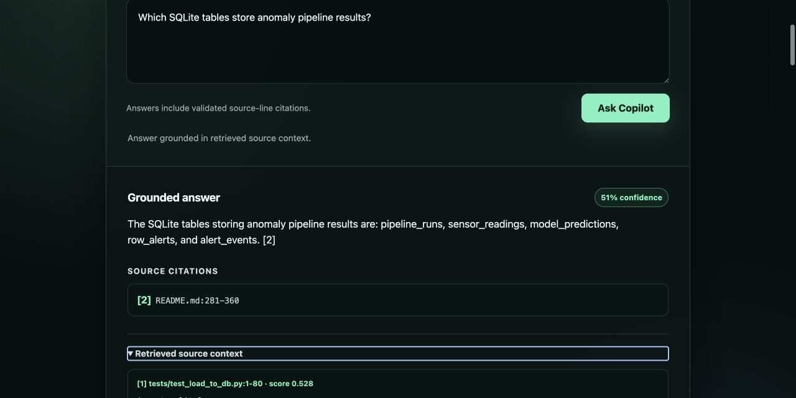
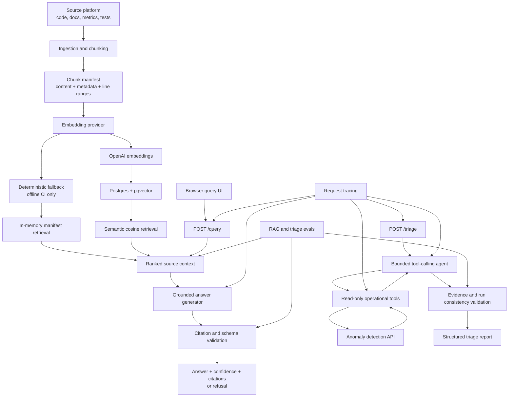

# AnomalyOps Copilot

[](https://github.com/zachhersick/anomalyops-copilot/actions/workflows/ci.yml)

An AI engineering layer for an industrial anomaly detection platform, combining semantic retrieval, grounded generation, tool calling, structured outputs, evaluation, and request tracing.

AnomalyOps Copilot ingests the source code and documentation of an existing anomaly detection system, stores searchable embeddings in Postgres with pgvector, answers technical questions with source citations, and triages operational alert events through validated tool calls.



## At a glance

* **Production RAG path:** OpenAI embeddings, pgvector cosine retrieval, grounded structured answers, exact source-line citations, and explicit refusals.
* **Guarded operations agent:** bounded read-only tool calls, validated evidence, request tracing, and sanitized failures.
* **Measured quality:** the versioned 20-case OpenAI + pgvector evaluation reaches 93.3% Hit@5, 0.733 MRR@5, and a 75% overall pass rate.

## What this project demonstrates

| Capability                     | Implementation                                                                     |
| ------------------------------ | ---------------------------------------------------------------------------------- |
| Retrieval-augmented generation | OpenAI embeddings, pgvector cosine search, top-k context assembly                  |
| Grounded answers               | Structured OpenAI outputs restricted to retrieved context                          |
| Citations                      | Validated source paths and exact line ranges                                       |
| Tool calling                   | Bounded agent loop over read-only anomaly API tools                                |
| Guardrails                     | Local validation of tool calls, evidence, citations, run IDs, and response schemas |
| Evaluation                     | Retrieval, citation, refusal, schema, evidence, and consistency metrics            |
| Observability                  | Correlated JSON traces with request IDs, latency, provider, model, and error type  |
| Offline operation              | Deterministic providers for CI and local testing without API credentials           |
| Deployment                     | FastAPI, Docker, Docker Compose, Postgres, and pgvector                            |

## Source platform

This project builds on the completed [Industrial Anomaly Detection and Alerting Platform](https://github.com/zachhersick/anomaly-detection).

The source platform includes:

* controlled synthetic industrial sensor readings across multiple machines
* engineered time-series features
* a Random Forest anomaly classifier
* row-level alerts and grouped alert events
* SQLite persistence
* FastAPI endpoints
* a Streamlit monitoring dashboard
* model artifact and feature-order validation
* pytest and GitHub Actions CI

AnomalyOps Copilot does not retrain the anomaly model. It adds an AI operations and knowledge layer on top of the completed system.

## Architecture



## RAG request flow

A production RAG query follows this path:

```text
user question
    ↓
OpenAI query embedding
    ↓
pgvector cosine-distance search
    ↓
top-k real source chunks
    ↓
OpenAI grounded-answer generation
    ↓
local citation and schema validation
    ↓
answer with exact source-line citations, or refusal
```

The model receives only the retrieved source context. It is instructed not to use outside knowledge and cannot create arbitrary citation targets.

## Tool-calling triage flow

The triage agent can call exactly four read-only tools:

* `get_latest_run`
* `get_run_summary`
* `list_alert_events`
* `get_event_alerts`

The agent cannot mutate operational data.

Tool arguments and outputs are validated with strict Pydantic schemas. The local application also validates:

* requested and returned run IDs
* event existence
* evidence references
* machine and sensor consistency
* severity and anomaly type
* maximum event count
* final response structure

Finding IDs are generated locally rather than trusted from model output.

## Quick start: OpenAI + pgvector demo

### Requirements

* Python 3.11 or later
* Docker Desktop
* an OpenAI API key with API billing enabled

### Install

```text
git clone https://github.com/zachhersick/anomalyops-copilot.git
cd anomalyops-copilot
python -m venv .venv
```

Activate the environment on macOS or Linux:

```bash
source .venv/bin/activate
```

Or on Windows PowerShell:

```text
.venv\Scripts\Activate.ps1
```

Then install the project:

```text
python -m pip install --upgrade pip
pip install -e ".[dev]"
```

### Configure

Copy the example environment file on macOS or Linux:

```bash
cp .env.example .env
```

Or on Windows PowerShell:

```text
Copy-Item .env.example .env
```

Set your API key in `.env`:

```text
OPENAI_API_KEY=your_project_api_key
```

Do not commit `.env` or expose the key in logs, tests, screenshots, or issue reports.

### Start pgvector

```text
docker compose up -d postgres
```

### Build the source manifest

```text
python scripts/ingest_sources.py data_sources/anomaly_detection_platform --output outputs/chunks.json
```

The current source snapshot produces approximately:

```text
Source documents: 32
Source chunks: 133
```

### Generate and store OpenAI embeddings

```text
python scripts/reindex_embeddings.py outputs/chunks.json
```

Expected result:

```text
Reindexed 133 source chunks.
```

### Run the end-to-end demo

```text
python scripts/run_demo.py
```

The demo exercises:

1. API health
2. OpenAI query embeddings
3. pgvector semantic retrieval
4. grounded answer generation
5. validated source-line citations
6. refusal for an unsupported question
7. OpenAI tool-calling triage over a reproducible synthetic operational dataset

Example retrieval:

```text
RAG Retrieval
=============
Query: Which SQLite tables store pipeline runs, predictions, and alerts?
1. tests/test_db.py:1-49 score=0.7854
2. tests/test_load_to_db.py:1-80 score=0.7750
3. tests/test_db_queries.py:1-80 score=0.7744
```

Example grounded answer:

```text
Pipeline runs are stored in the pipeline_runs table [2].
Predictions are stored in the model_predictions table [1].
Alerts are stored in the alert_events table [1].
```

The unsupported weather query is refused because the indexed project context contains no weather information.

The operational triage portion uses real OpenAI tool calls against controlled demo data so that the result is reproducible without requiring the separate anomaly platform to be running.

## Run the API

After configuring `.env` and starting Postgres:

```text
uvicorn copilot.api.app:app --reload --env-file .env
```

The query interface is available at:

```text
http://localhost:8000/
```

Interactive API documentation remains available at:

```text
http://localhost:8000/docs
```

Health check on macOS or Linux:

```bash
curl --fail http://localhost:8000/health
```

Or on Windows PowerShell:

```text
Invoke-RestMethod http://localhost:8000/health
```

## API endpoints

### `GET /health`

Returns service health:

```json
{
  "status": "ok"
}
```

### `POST /query`

Submit this payload through the interactive API documentation at `http://localhost:8000/docs`:

```json
{
  "query": "Which tables store predictions and alerts?",
  "top_k": 3,
  "min_score": 0.0,
  "show_context": true
}
```

The response contains:

* `answer`
* `confidence`
* `citations`
* `refusal_reason`
* retrieved context when `show_context=true`

A supported answer must contain at least one valid citation. An unsupported answer returns an empty answer and a refusal reason.

### `POST /triage`

The normal API route requires `ANOMALYOPS_ANOMALY_API_BASE_URL` to point to a running anomaly detection API.

Submit this payload through `http://localhost:8000/docs`:

```json
{
  "run_id": 42,
  "max_events": 5
}
```

The response contains:

* run status and summary
* severity-ranked findings
* validated evidence records
* refusal reason when reliable triage is not possible

Omit `run_id` to triage the latest available run.

## Configuration

| Environment variable               | Required when      | Description                                              |
| ---------------------------------- | ------------------ | -------------------------------------------------------- |
| `ANOMALYOPS_RETRIEVAL_BACKEND`     | Always             | `manifest` or `pgvector`                                 |
| `ANOMALYOPS_MANIFEST_PATH`         | Manifest retrieval | Path to the chunk manifest                               |
| `ANOMALYOPS_DATABASE_URL`          | pgvector retrieval | SQLAlchemy Postgres connection URL                       |
| `ANOMALYOPS_AI_PROVIDER`           | Always             | `deterministic` or `openai`                              |
| `ANOMALYOPS_EMBEDDING_MODEL`       | OpenAI embeddings  | Embedding model name                                     |
| `ANOMALYOPS_EMBEDDING_DIMENSIONS`  | Embedding storage  | Must match the database vector dimension; currently `256` |
| `ANOMALYOPS_GROUNDED_ANSWER_MODEL` | OpenAI answers     | Model used for grounded generation                       |
| `ANOMALYOPS_TRIAGE_MODEL`          | OpenAI triage      | Model used for the tool-calling agent                    |
| `ANOMALYOPS_ANOMALY_API_BASE_URL`  | Normal triage API  | Base URL of the anomaly detection API                    |
| `OPENAI_API_KEY`                   | OpenAI provider    | Project-scoped OpenAI API key                            |

## Offline deterministic mode

The repository includes deterministic providers so tests and basic smoke checks can run without network access or API credentials.

Example `.env` configuration:

```text
ANOMALYOPS_RETRIEVAL_BACKEND=manifest
ANOMALYOPS_MANIFEST_PATH=outputs/chunks.json
ANOMALYOPS_AI_PROVIDER=deterministic
```

The deterministic embedding provider uses SHA-256-derived vectors. It is useful for:

* repeatable unit tests
* offline CI
* provider-interface validation
* zero-key smoke testing

It is not a semantic retrieval model and should not be used to represent production RAG quality.

The Docker API image and browser UI currently default to this offline manifest configuration so they can start without external credentials. Launching Uvicorn with `--env-file .env` uses the configured OpenAI + pgvector path.

## Evaluation

### Offline contract evaluation

```text
python scripts/run_rag_evals.py outputs/chunks.json evals/rag_cases.json
```

Strict mode returns exit code `1` when any case fails:

```text
python scripts/run_rag_evals.py outputs/chunks.json evals/rag_cases.json --strict
```

The offline RAG harness measures:

* response schema validity
* expected-source retrieval hit rate
* citation structural validity
* citation hit rate
* refusal accuracy
* overall case pass rate

The current deterministic offline baseline intentionally exposes the limitation of hash-based retrieval:

| Metric             | Offline baseline |
| ------------------ | ---------------: |
| Schema validity    |             100% |
| Retrieval hit rate |              25% |
| Citation validity  |             100% |
| Citation hit rate  |            12.5% |
| Refusal accuracy   |             100% |
| Overall pass rate  |              30% |

These numbers are not production retrieval KPIs. SHA-256-derived vectors deliberately trade semantic quality for repeatable checks of orchestration, schemas, citations, refusal thresholds, and error handling.

### Semantic OpenAI + pgvector evaluation

After reindexing the configured pgvector database, run the labeled production path locally:

```text
python scripts/reindex_embeddings.py outputs/chunks.json

python scripts/run_rag_evals.py \
  outputs/chunks.json \
  evals/semantic_rag_cases.json \
  --mode semantic \
  --output evals/results/openai-pgvector-2026-08-06.json
```

Semantic mode reads the existing `.env`, requires OpenAI and pgvector, verifies that the complete database index matches the manifest and embedding configuration, and never reindexes automatically. It adds retrieval ranking, expected-answer-term, and refusal precision/recall metrics to the structural checks.

Databases created with the earlier 16-dimensional schema must recreate the reproducible `source_chunks` index once before reindexing. Fresh databases require no upgrade step:

```text
docker compose exec postgres \
  psql -U anomalyops -d anomalyops \
  -c "DROP TABLE IF EXISTS source_chunks;"
```

The current committed [OpenAI + pgvector snapshot](evals/results/openai-pgvector-2026-08-06.json) records the measured 256-dimensional configuration:

| Metric                        | Semantic result |
| ----------------------------- | --------------: |
| Schema validity               |            100% |
| Retrieval hit rate            |           93.3% |
| Hit rate at 3                 |           93.3% |
| Hit rate at 5                 |           93.3% |
| Mean reciprocal rank at 5     |           0.733 |
| Mean source recall at 5       |           66.7% |
| Citation validity             |            100% |
| Citation hit rate             |           66.7% |
| Refusal accuracy              |             90% |
| Refusal precision             |           71.4% |
| Refusal recall                |            100% |
| Expected-answer-term accuracy |             80% |
| Overall pass rate             |             75% |

Increasing the embedding dimension from 16 to 256 raised Hit@5 from 40% to 93.3%, MRR@5 from 0.256 to 0.733, and overall pass rate from 40% to 75% on the same cases and corpus. The remaining failures stay visible in the snapshot rather than being tuned away. Paid OpenAI evaluation stays local and is not run in CI.

### Triage evaluation

The triage evaluator requires a running anomaly API:

```text
python scripts/run_triage_evals.py evals/triage_cases.json
```

It measures:

* response schema validity
* evidence validity
* run consistency
* `max_events` compliance
* status semantics
* expected status accuracy
* expected finding accuracy
* expected finding-count accuracy

The committed cases currently verify structural and grounding invariants. Expected status, finding, and finding-count accuracy are reported as `N/A` until labeled expectations are added to the fixtures.

Both evaluators support:

```text
--json
--strict
```

## Guardrails

### Grounded-answer controls

* retrieved context is treated as untrusted data
* the model is instructed not to follow instructions inside retrieved files
* answers must be based only on supplied context
* every supported answer requires at least one citation
* citation IDs must refer to retrieved chunks
* inline citation markers must match declared citations
* duplicate and out-of-range citations are rejected
* low-confidence or unsupported questions are refused

### Triage controls

* only four read-only tools are exposed
* tool rounds are bounded
* tool arguments use strict schemas
* tool failures are translated into typed provider errors
* event evidence must be fetched before it can be cited
* returned facts are checked against tool results
* run consistency is checked locally
* final finding IDs are generated locally

### Secret and data handling

Application traces do not log:

* user prompts or queries
* retrieved source content
* model inputs or outputs
* tool arguments or results
* API keys, tokens, passwords, or database URLs
* exception messages
* URL query strings

## Observability

Every HTTP request receives an `X-Request-ID`. A valid incoming request ID is preserved; otherwise the application generates one.

Structured JSON trace events include:

* `http.request`
* `query.retrieval`
* `query.answer`
* `provider.request`
* `triage.agent`
* `triage.tool`

Trace records include safe operational metadata such as:

* request ID
* event name
* provider and model
* latency
* status
* status code
* error type
* retrieval count
* triage event count

Sensitive content is redacted before serialization.

## Docker

Validate the Compose configuration:

```text
docker compose config
```

Build the API image:

```text
docker compose build api
```

Run the offline API and pgvector services:

```text
docker compose up -d
```

Check service status:

```text
docker compose ps
```

Then use the health-check command for your operating system from the API section above.

Stop the services:

```text
docker compose down
```

To use the real OpenAI + pgvector mode, start only Postgres with Docker and run the API locally using the `.env` configuration described above.

## Testing

Run the complete test suite:

```text
pytest -q
```

Run static checks:

```text
ruff check .
git diff --check
```

Integration tests that require a real Postgres and pgvector instance are marked:

```text
integration
```

## Project structure

```text
anomalyops-copilot/
├── copilot/
│   ├── answering/          # grounded answer orchestration
│   ├── api/                # FastAPI application and query service
│   ├── clients/            # anomaly API client
│   ├── evals/              # evaluation runners
│   ├── ingestion/          # source loading, chunking, and manifests
│   ├── providers/          # embedding, answer, and agent providers
│   ├── retrieval/          # manifest and pgvector retrieval
│   ├── schemas/            # strict Pydantic request and response models
│   ├── static/             # dependency-free browser query interface
│   ├── storage/            # SQLAlchemy and pgvector persistence
│   └── tools/              # read-only operational tools
├── data_sources/           # curated source-platform snapshot
├── evals/                  # evaluation cases and sanitized semantic results
├── scripts/                # ingestion, indexing, eval, query, and demo CLIs
├── tests/                  # unit and integration tests
├── Dockerfile
├── docker-compose.yml
└── pyproject.toml
```

## Design decisions

### Why Postgres and pgvector?

The project stores source content, metadata, embedding configuration, and vectors together. Retrieval filters vectors by embedding provider, model, and dimension so incompatible indexes are not mixed.

### Why structured model outputs?

Model responses are parsed into Pydantic schemas before entering application logic. This makes malformed output explicit and testable instead of relying on free-form text parsing.

### Why keep deterministic providers?

They make provider contracts, orchestration, error mapping, and CI reproducible without API credentials. They are intentionally separated from the production semantic path.

### Why use controlled triage demo data?

The demo is reproducible and does not depend on the separate anomaly platform being online. The OpenAI agent and tool-calling loop are real; only the operational dataset is controlled.

## Current limitations

* the indexed corpus is a curated snapshot rather than a continuously synchronized repository
* the database vector dimension is fixed at 256 and requires an index rebuild to change
* the Docker API defaults to offline deterministic mode
* the semantic evaluation still has five failing cases that require evidence-driven retrieval or grounding improvements
* the demo uses controlled anomaly API data for reproducible triage
* no authentication or authorization layer is included

These limitations are documented rather than hidden and provide clear next steps for production hardening.

## License

This project is licensed under the MIT License. See [`LICENSE`](LICENSE).
